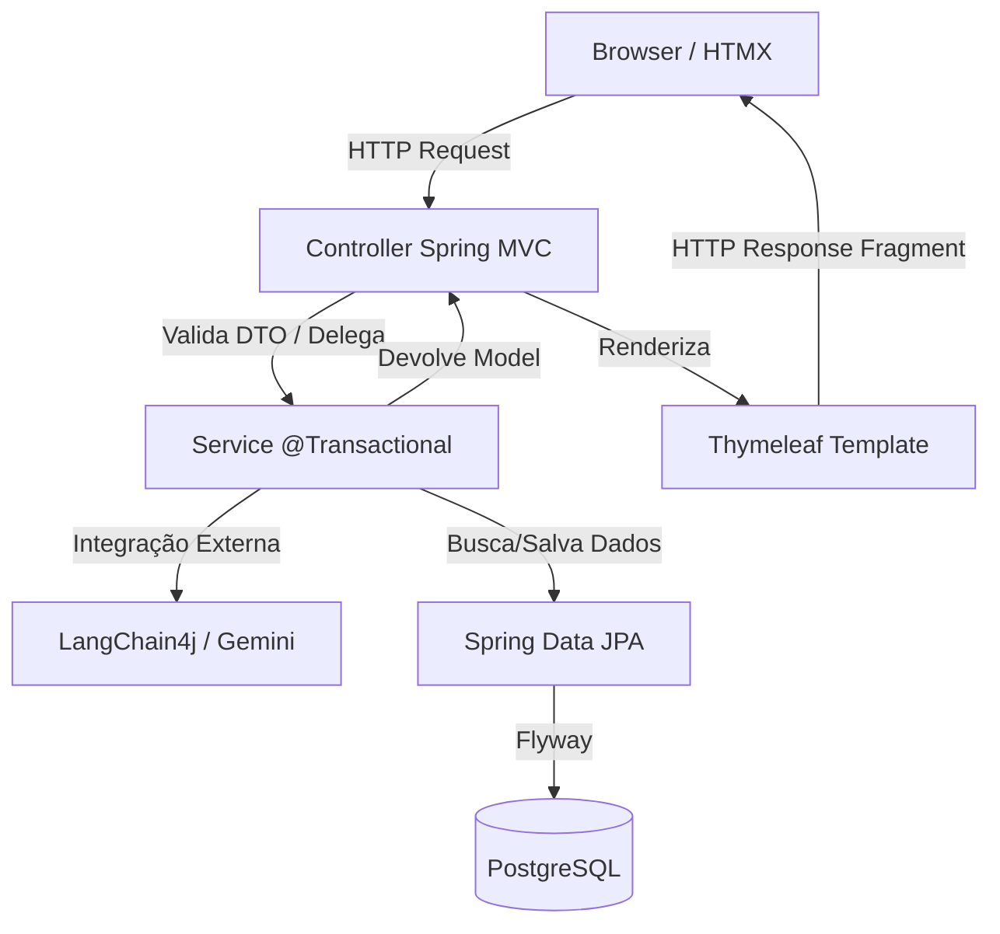

# 01. Arquitetura do Sistema

O StudyAI adota uma arquitetura em camadas tradicional do ecossistema Spring (Server-Side Rendering MVC) em conjunto com **HTMX** para prover reatividade sem a necessidade de um framework SPA (React/Vue).

## Visão Geral das Camadas

## Padrão HTMX: SSR Reativo

Usamos **HTMX** para melhorar a experiência do usuário. Em vez de recarregar a página inteira, o servidor retorna **fragmentos de HTML** que o HTMX injeta dinamicamente na página.

**Vantagens para este projeto**:
- Nenhum bundle JavaScript massivo (React/Vue).
- Acesso direto ao contexto de segurança do Spring (Spring Security).
- A IA sempre roda no servidor, mantendo as chaves de API ocultas e seguras.
- Formulários complexos são processados sem *page refresh*.

### Fluxo de Geração (Exemplo HTMX)
1. O usuário clica em "Gerar Flashcards".
2. O formulário dispara um `hx-post="/flashcards/gerar"` pro Spring.
3. O `FlashcardController` aciona o `FlashcardService` e a IA.
4. O Spring retorna o fragmento `fragments/flashcard-result :: cards`.
5. O HTMX substitui apenas a `
` na tela.

## Camadas em Detalhe

### Controller (`br.ufpb.dsc.studyai.controller`)
- Anotados com `@Controller`.
- Recebem a requisição, injetam dados no `Model` do Thymeleaf.
- Validam dados de entrada. NUNCA contêm lógica de negócio.

### Service (`br.ufpb.dsc.studyai.service`)
- Anotados com `@Service`.
- Toda regra de negócio (geração de conteúdo via IA, cálculos de estatística, processamento).
- Onde residem as transações de banco de dados (`@Transactional`).
- Falhas devem lançar *Exceptions* de negócio personalizadas (ex: `IAIndisponivelException`).

### Repository (`br.ufpb.dsc.studyai.repository`)
- Interfaces que herdam de `JpaRepository`.
- Nenhuma query SQL manual, apenas JPQL limpo ou *query methods* do Spring Data.

### Domain (`br.ufpb.dsc.studyai.domain`)
- Onde as tabelas do banco são modeladas em classes Java (`@Entity`).
- Elas ditam a modelagem JPA, mas não resolvem regras complexas (modelo anêmico com métodos de conveniência).

## DTOs (Data Transfer Objects)
Sempre usamos `record` (recurso do Java moderno) para os DTOs.
Ex: `public record CorretorRequest(String banca, String tema, String texto) {}`. Isso garante imutabilidade.

## Flyway: Gerenciamento de Schema

Todo o banco é criado iterativamente pelo Flyway (pasta `src/main/resources/db/migration/`).

**Regra de ouro**: NUNCA edite um script `.sql` depois que ele já foi aplicado e commitado na branch `main`. O Flyway valida checksums; se você alterar, a aplicação não subirá. Sempre crie um arquivo novo (`V2__`, `V3__`, `V4__`...).
